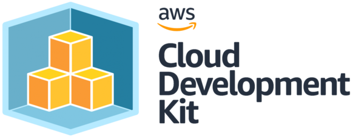

# AWS CDK Workshop
**If you start this workshop you will first run a script, this will install the most recent AWS CDK version and set up the basics for this new CDK project using Typescript. You get a simple Lambda and an S3 Bucket. It will execute a first commit and shows the results. It will synthesize the app and if successful it shows the newly created stack.**

**Click the link to start this workshop: [Start Workshop](copy/FREADME.md)**

