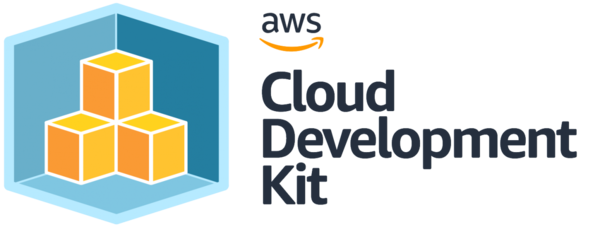

# AWS CDK Workshop

## Deploy a Lambda function and a S3 Bucket with the AWS CDK

**If you start this workshop you will first run a script, this will install the most recent AWS CDK version and set up the basics for this new CDK project using Typescript. You get a simple Lambda and an S3 Bucket. It will execute a first commit and shows the results. It will synthesize the app and if successful it shows the newly created stack.**

### Prerequisites:
- Go
- Python
- Makefile

---

**Click the link to start this workshop: [START WORKSHOP](README_WORKSHOP.md)**

## Development process via Makefile

To simplify the development process and provide an ability to run tests locally we use a Makefile. A developer can execute a series of actions or execute individual steps.

* Build and validate: `make`
* Execute integration tests: `make test`
* Validate new and changed stacks with the current state: `make compare`
* Cleanup the environment: `make clean`

Check the make file for more options.

---

**Additional info:** [README_DEV.md](README_DEV.md)
