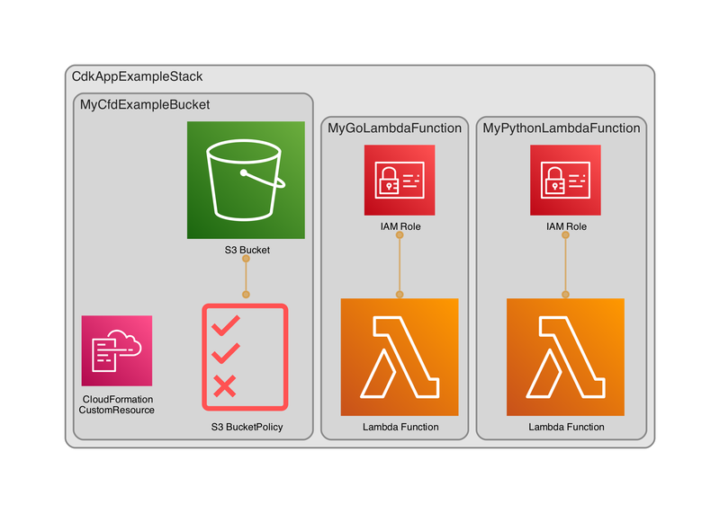

# Get Started with the AWS CDK Workshop 

### Prerequisites:
- IDE for your programming language
- Go
- SAM
- Node.js
- Makefile
- AWS CLI
- AWS Account and User 
- AWS CDK Toolkit
- Python

**Info:iIf you start this workshop you will first run a script, this will install the most recent AWS CDK version and set up the basics for this new CDK project using Typescript. You get a simple Lambda and an S3 Bucket. It will execute a first commit and shows the results. It will synthesize the app and if successful it shows the newly created stack. It will also provide you with some basic tests.**


## Development process via Makefile

To simplify the development process and provide an ability to run tests locally you can use the make file. You can execute a series of actions or execute individual steps.

* Build and validate: `make`
* Execute integration and security tests: `make test`
* Compare local stacks with the deployed stacks: `make compare`
* Cleanup the environment: `make clean`

Look at the Makefile for the other options.                 
> **Tip:**                      
> When getting an error running the makefile, check the Makefile with`cat -e -t -v Makefile`                        
> It shows the presence of tabs with ^I and line endings with $.                    


### Instructions

**1 - Run this script, fill in the variables and let it finish. Your repository will be created in the root of your $HOME folder.**
```shell 
1-new-cdk-app.sh
```

**2 - Refactor the package.json file with the following entries. There is an example provided which you can just copy and paste or type in manually. Be sure to do a `npm install` when you are finished and update the packages if needed.
We need this if we want to create proper test suites.**
```json
{
  "name": "cdk-app-example",
  "version": "0.1.0",
  "bin": {
    "cdk-app-example": "bin/cdk-app-example.js"
  },
  "scripts": {
    "build clean": "tsc --build --clean"
  },
  "devDependencies": {
    "eslint": "^9.6.0",
    "jest-junit": "16.0.0"
  },
  "dependencies": {
  },
  "engines": {
    "npm": ">=9.0.0",
    "node": ">=20.0.0"
  },
  "jest-junit": {
    "suiteName": "jest tests",
    "outputDirectory": "./test-results",
    "outputName": "junit.xml",
    "uniqueOutputName": "false",
    "classNameTemplate": "{classname}-{title}",
    "titleTemplate": "{classname}-{title}",
    "ancestorSeparator": " › ",
    "usePathForSuiteName": "true"
  },
  "audit-level": "critical",
  "lint-staged": {
    "**/*.ts": [
      "npm run test"
    ]
  }
}
```

**2a - Optional - remove deprecated packages with this script (check the workshop files directory):**

```shell
#!/bin/bash

echo "Uninstall deprecated packages"

# This module is not supported, and leaks memory.
npm r inflight@1.0.6
# Deprecated
npm r source-map-support
npm r glob@7.2.3
```

**3 - Update your .gitignore file with these entries:**

```text
# Node artifact files
node_modules/
dist/

# Log files
*.log

# JetBrains IDE
/.idea/

# Unit test reports
TEST*.xml

# Generated by MacOS
.DS_Store

# CDK asset staging directory
.cdk.staging
cdk.out

# cdk
*.js
*.d.ts
!jest.config.js
!/lib/
!/test/
!.eslintignore
!.eslintrc.js
!.npmignore
!cdk.json
!tsconfig.json
!package.json
!package-lock.json

# Folders
/test/__snapshots__/
/test-results/
/.tests/junit.xml
cdk.out/
coverage/
test-results/

# Files
test-report.xml
!.meta-repo.yml
!.npmrc
```

4 - If the copy action was success full (which is part of the script) the makefile and the optimized jest.config.js files are copied over to the new project. Check if they are identical to the source files.

**5 - Add logic for the Lambda's.**
ToDo

**3 - Run the tests.**
ToDo

**5 - Then inside the "cdk-app-example" folder run these commands:**

* `npx cdk synth -q`   emits the synthesized CloudFormation template, check the `cdk.out` folder for a template.json file.
* `tsc`  compile typescript to js, check for errors.
* `tsc --build --clean` clean up js.
* `aws sso login`  use your terminal to log in to your AWS account.
* `npx cdk deploy`  deploy this stack to your default AWS account.
* `aws s3 ls`  check for the 'my-nca-demo-bucket' in your AWS account.
* `npx cdk destroy`  destroy the resources, wait for the process to finish.

Most likely you have to initialize Go in this project.

**Open the AWS console and look for the resources you just created.**

---

**If you want to remove the demo go to the directory where you installed it and run: `rm -rvf cdk-app-example`. If you re-run the demo it will first remove the old one.**                  
**This is a very simple stack, in a real world scenario you would use a pipeline to deploy your resources.**

**As you can see in the diagram, CDK generated a custom resource, that is because we used the auto delete objects option for the s3 Bucket.**

                                

## Environment variables for Snyk CLI
You can set environment variables to change CLI settings.

**SNYK_TOKEN** Override the token in your Snyk config settings (~/.config/configstore/snyk.json).              
**SNYK_CFG_<KEY>** Allows you to override any key that is also available as a snyk config option.              
Example, **SNYK_CFG_ORG=<your_org>>** overrides the default org option in config.     
Check your snyk config file:
```shell
snyk config
```

## Snyk to HTML
You can use snyk-to-html to create an HTML report.
Install snyk-to-html:
```shell
npm i -g snyk-to-html
```
