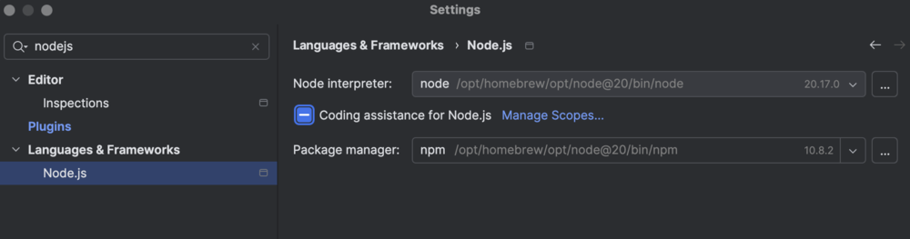
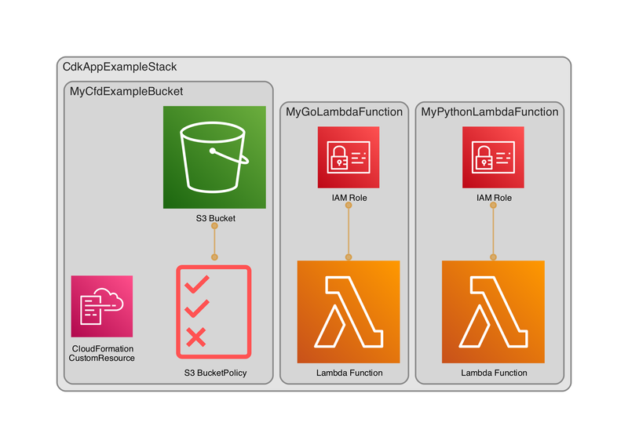

# Get Started with the AWS CDK Workshop 

### Prerequisites:
- IDE for your programming language
- Go
- SAM
- Node.js
- Makefile
- AWS CLI
- AWS Account and User 
- AWS CDK Toolkit
- Python

For intellij enable code completion for nodejs. intellij/settings, type in nodejs /language & frameworks/Node.Js then enable coding assistance for Node.js. see screenshot.



**Info: if you start this workshop you can choose between two scripts:**            
1. A regular script which will install the most recent AWS CDK version and set up the basics for a new CDK project using Typescript. It will synthesize the app and if successful it shows the newly created stack.
2. A variable script where you can choose the name of your app, and where you have to manually refactor some logic. the rest of the logic is the same as for scri[pt 1.
3. For both variant we will create a simple Lambda function and an S3 Bucket and will also add some tests, just follow the instructions below.


## Development process via Makefile

To simplify the development process and provide an ability to run tests locally you can use the make file. You can execute a series of actions or execute individual steps.

* Build and validate: `make`
* Execute integration and security tests: `make test`
* Compare local stacks with the deployed stacks: `make compare`
* Cleanup the environment: `make clean`

Look at the Makefile for the other options.

---


### Instructions

**1 - Run the preferred script, you can choose between script 1 or 2. Fill in the optional variables and let it finish. Your repository will be created in the root of your $HOME folder. The scripts are located in the `workshop files` directory.**
```shell 
1-create_new_cdk_app.sh
```
or
```shell 
2-create_new_cdk-app_with_variable_name.sh
```

**2 - Refactor the package.json file with the following entries. This is an example where you can just copy and paste the lines. Be sure to use the latest cdk version and do a `npm install` when you are finished, update other packages if needed.
We need this adjustments if we want to create and run proper test suites.**
```json
{
  "name": "cdk-app-example",
  "version": "0.1.0",
  "bin": {
    "cdk-app-example": "bin/cdk-app-example.js"
  },
  "scripts": {
    "build": "tsc",
    "build clean": "tsc --build --clean",
    "watch": "tsc -w",
    "test": "jest",
    "cdk": "cdk"
  },
  "devDependencies": {
    "@types/jest": "^29.5.12",
    "@types/node": "22.5.4",
    "aws-cdk": "2.158.0",
    "jest": "^29.7.0",
    "ts-jest": "^29.2.5",
    "ts-node": "^10.9.2",
    "typescript": "~5.6.2",
    "eslint": "^9.6.0",
    "jest-junit": "16.0.0"
  },
  "dependencies": {
    "aws-cdk-lib": "2.158.0",
    "constructs": "^10.0.0"
  },
  "engines": {
    "npm": ">=9.0.0",
    "node": ">=20.0.0"
  },
  "jest-junit": {
    "suiteName": "jest tests",
    "outputDirectory": "./test-results",
    "outputName": "junit.xml",
    "uniqueOutputName": "false",
    "classNameTemplate": "{classname}-{title}",
    "titleTemplate": "{classname}-{title}",
    "ancestorSeparator": " › ",
    "usePathForSuiteName": "true"
  },
  "audit-level": "critical",
  "lint-staged": {
    "**/*.ts": [
      "npm run test"
    ]
  }
}

```

**2a - Optional: remove deprecated packages with this script (check the workshop files directory):**

```shell
#!/bin/bash

echo "Uninstall deprecated packages"

# This module is not supported, and leaks memory.
npm r inflight@1.0.6
# Deprecated
npm r source-map-support
npm r glob@7.2.3
```

**3 - Optional: if you use script 2, update your `.gitignore` file with these entries:**

```text
# Node artifact files
node_modules/
dist/

# Log files
*.log

# JetBrains IDE
/.idea/

# Unit test reports
TEST*.xml

# Generated by MacOS
.DS_Store

# CDK asset staging directory
.cdk.staging
cdk.out

# cdk
*.js
*.d.ts
!jest.config.js
!/lib/
!/test/
!.eslintignore
!.eslintrc.js
!.npmignore
!cdk.json
!tsconfig.json
!package.json
!package-lock.json

# Folders
/test/__snapshots__/
/test-results/
/.tests/junit.xml
cdk.out/
coverage/
test-results/

# Files
test-report.xml
!.meta-repo.yml
!.npmrc
```

**4 - If you use script 2 copy the makefile, the new `.gitignore` file and the optimized `jest.config.js` file to your repository and overwrite the old files. Check if they are identical to the source files.**

**5 - Add logic for the stacks. Search for the `.ts` file in the bin folder and edit it so that it is identical to the one below. We added the environment variables and an `enum` and `const` to declare some variables. We also add the tags here to make sure all resources in the template are tagged. You can copy the contents or type it. Just make sure that you don't change your app or stackname to prevent them from being deleted. You can also delete this line `import `source-map-support/register`: see step 2a. Remember to change the stack and app names to the names of your stack and app!**

```typescript
#!/usr/bin/env node
import * as cdk from 'aws-cdk-lib';
import {CdkAppExampleStack} from '../lib/cdk-app-example-stack';
import {Stack, Tags} from "aws-cdk-lib";

export const env = {
    account: process.env.CDK_SYNTH_ACCOUNT || process.env.CDK_DEFAULT_ACCOUNT,
    region: process.env.CDK_SYNTH_REGION || process.env.CDK_DEFAULT_REGION,
};

enum Environment {
    dev = 'dev'
}

const application = 'cnca-cdk-example';

const addTags = (stack: Stack, environment: Environment) => {
    Tags.of(stack).add('Application', application, {
        applyToLaunchedInstances: true,
        includeResourceTypes: [],
    });
    Tags.of(stack).add('Stage', environment, {
        applyToLaunchedInstances: true,
        includeResourceTypes: [],
    });
    Tags.of(stack).add('Stackname', stack.stackName, {
        applyToLaunchedInstances: true,
        includeResourceTypes: [],
    });
};

const app = new cdk.App();
const cdkAppExampleStack = new CdkAppExampleStack(app, 'CdkAppExampleStack', {
    stackName: 'CdkAppExampleStack',
    description: 'Example stack for CF&D onboarding.',
    env,
});
addTags(cdkAppExampleStack, Environment.dev);

app.synth();
```

**5a - Search for the stack in the `lib` folder and refactor the stack like the example below to build the bucket and the Lambda function resources.**

```typescript
import * as cdk from 'aws-cdk-lib';
import {aws_iam, aws_s3, RemovalPolicy} from 'aws-cdk-lib';
import {Construct} from 'constructs';


export class CdkAppExampleStack extends cdk.Stack {
    constructor(scope: Construct, id: string, props?: cdk.StackProps) {
        super(scope, id, props);

        const myExampleBucket = new aws_s3.Bucket(this, 'my-cnca-demo-bucket', {
            bucketName: 'my-cnca-demo-bucket',
            // disable access control lists (ACLs) and take ownership of every object in your bucket.
            objectOwnership: aws_s3.ObjectOwnership.BUCKET_OWNER_ENFORCED,
            // permissions on new objects are private by default and don’t allow public access.
            blockPublicAccess: aws_s3.BlockPublicAccess.BLOCK_ALL,
            encryption: aws_s3.BucketEncryption.S3_MANAGED,
            enforceSSL: true,
            versioned: true,
            removalPolicy: RemovalPolicy.DESTROY,
            // with this setting cdk will deploy a lambda and a custom resource.
            autoDeleteObjects: true,
        });
        // give the AWS account owner read access
        myExampleBucket.grantRead(new aws_iam.AccountRootPrincipal());
    }
}
```

**10 - Build the app and run the tests. You will notice 2 test reports. One is for the code coverage, click through to find out more. The other one is for the Snyk security scan. See if it detected any problems and try to fix them if it found any problems.**

```shell
make build
```

**11 - Go to the `cdk-app-example` folder and run these commands, this will deploy your resources in AWS.**

* `aws sso login`  use your terminal to log in to your AWS account.
* `npx cdk deploy`  deploy this stack to your default AWS account.
* `aws s3 ls`  check for the 'my-cnca-demo-bucket' in your AWS account.

Most likely you have to initialize Go in this project.

**Open the AWS console and look for the resources you just created.**


**Final step - After you finished you can clean up the resources with `npx cdk destroy name_of_your_stack`, wait for the process to finish.**

## Congratulations!

---

**If you want to remove the demo repository go to the directory where you installed it and run: `rm -rvf cdk-app-example`. If you re-run the demo it will automatically remove the old one.**                  
**This is a very simple stack, in a real world scenario you would use a pipeline to deploy your resources.**

**As you can see in the diagram, CDK generated a custom resource, that is because we used the auto delete objects option for the s3 Bucket.**

                                

## Environment variables for Snyk CLI
You can set environment variables to change CLI settings.

**SNYK_TOKEN** Override the token in your Snyk config settings (~/.config/configstore/snyk.json).              
**SNYK_CFG_<KEY>** Allows you to override any key that is also available as a snyk config option.              
Example, **SNYK_CFG_ORG=<your_org>>** overrides the default org option in config.     
Check your local snyk config file:
```shell
snyk config
```

## Snyk to HTML
You can use snyk-to-html to create an HTML report.
Install snyk-to-html:
```shell
npm i -g snyk-to-html
```
